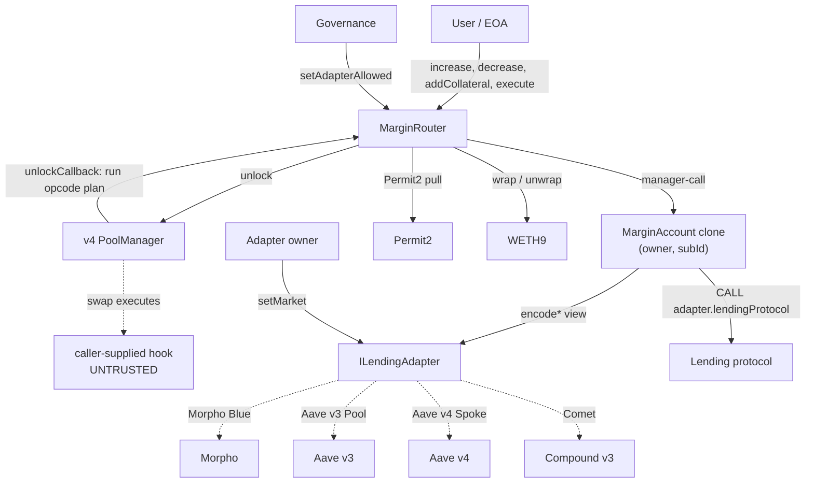

# X-Ray Pre-Audit Report — Margin Trading Suite

| | |
|---|---|
| **Protocol** | Uniswap v4-periphery Margin Trading Suite |
| **Repository** | `/Users/chris.cashwell/dev/v4-periphery` |
| **Branch / commit** | `margin-trading` @ `e3d86dd2f8199e4265adf0579ba3af953aeb2a0b` |
| **nSLOC in scope** | 1,326 across 19 files |
| **Solidity** | 0.8.26, fixed pragma, `via_ir`, `evm_version = cancun` |
| **Phase** | **Launch** — already deployed to Ethereum mainnet, low TVL |

This report is valid only for the commit above. Companion artifacts:
[entry-points.md](entry-points.md) (full classified entry-point inventory) and
[architecture.json](architecture.json) (machine-readable graph).

---

## 1. Architecture Overview

The margin suite turns a Uniswap v4 swap and a third-party lending market into a single-transaction
leveraged spot position. [`MarginRouter`](../src/MarginRouter.sol) is the only entry point. It builds
leverage as a flash-style operation inside one `PoolManager` unlock: buy the collateral
exact-output, take it to the user's position account, supply it as collateral, borrow the debt owed,
and settle the swap with the borrowed funds. Because v4's flash accounting lets the whole sequence
net inside one unlock, no flash-loan provider is involved and the position is atomic.

Each position lives in its own [`MarginAccount`](../src/MarginAccount.sol) — a Solady
clone-with-immutable-args deployed at a CREATE2 address derived from `(owner, manager, subId)`. The
clone *is* the borrower and supplier on the lending protocol, so it acts as itself and never needs
delegated authorization. Ownership is soulbound: `(owner, manager)` are baked into the clone's
bytecode, so there is no initializer to front-run and no transfer path. The router inherits
[`MarginAccountFactory`](../src/MarginAccountFactory.sol), which makes the router the `manager` of
every account it deploys and is what lets it drive their lending primitives directly.

Lending venues are abstracted behind [`ILendingAdapter`](../src/interfaces/ILendingAdapter.sol),
which is deliberately an **encoder**, not an executor: each `encode*` returns
`(target, value, calldata)` that the `MarginAccount` then executes as itself. This inverts the usual
trust direction. The adapter never holds funds, and the account owns every authority-bearing field —
it always passes itself as `onBehalf`, constrains every fund recipient to the manager or owner, and
always uses a regular `CALL`, never `DELEGATECALL`. Four adapters exist: Morpho Blue, Aave v3,
Aave v4, and Compound v3.

### Scope Table

| Contract | File | nSLOC | Type | Complexity | Key functions |
|---|---|---|---|---|---|
| MarginRouter | [src/MarginRouter.sol](../src/MarginRouter.sol) | 410 | Core | **High** | `increasePosition`, `decreasePosition`, `addCollateral`, `execute`, `_handleAction` |
| AaveV4LendingAdapter | [src/AaveV4LendingAdapter.sol](../src/AaveV4LendingAdapter.sol) | 155 | Adapter | Medium | `encode*`, `describePosition`, `setMarket` |
| CompoundV3LendingAdapter | [src/CompoundV3LendingAdapter.sol](../src/CompoundV3LendingAdapter.sol) | 148 | Adapter | Medium | `encode*`, `describePosition`, `setMarket` |
| AaveLendingAdapter | [src/AaveLendingAdapter.sol](../src/AaveLendingAdapter.sol) | 138 | Adapter | Medium | `encode*`, `describePosition`, `setMarket` |
| MorphoLendingAdapter | [src/MorphoLendingAdapter.sol](../src/MorphoLendingAdapter.sol) | 134 | Adapter | Medium | `encode*`, `describePosition`, `setMarket` |
| MarginAccount | [src/MarginAccount.sol](../src/MarginAccount.sol) | 105 | Core | Medium | `supplyCollateral`, `withdrawCollateral`, `borrow`, `repay`, `sweep`, `execute` |
| IMarginRouter | [src/interfaces/IMarginRouter.sol](../src/interfaces/IMarginRouter.sol) | 87 | Interface | — | Carries the behavioral spec, including the 8 `execute` rules |
| MarginCalldataDecoder | [src/libraries/MarginCalldataDecoder.sol](../src/libraries/MarginCalldataDecoder.sol) | 44 | Library | Low | 7 `abi.decode` helpers |
| Owner | [src/types/Owner.sol](../src/types/Owner.sol) | 33 | Type | Low | Two-step ownership |
| MarginAccountFactory | [src/MarginAccountFactory.sol](../src/MarginAccountFactory.sol) | 32 | Core | Low | `accountOf`, `createAccount` |
| Market | [src/types/Market.sol](../src/types/Market.sol) | 29 | Type | Low | `toSwapParams` (the pool/market choke point) |
| OwnableAdapter | [src/base/OwnableAdapter.sol](../src/base/OwnableAdapter.sol) | 24 | Base | Low | Shared adapter ownership |
| MarketRegistry | [src/types/MarketRegistry.sol](../src/types/MarketRegistry.sol) | 23 | Type | Low | `register`, `resolve`, `isSupported` |
| Ltv / LeverageX18 | [src/types/Ltv.sol](../src/types/Ltv.sol), [LeverageX18.sol](../src/types/LeverageX18.sol) | 30 | Types | Low | WAD-typed ratios |
| MarginActions | [src/libraries/MarginActions.sol](../src/libraries/MarginActions.sol) | 12 | Library | Low | Opcodes `0x30`–`0x38` |
| PositionData | [src/types/PositionData.sol](../src/types/PositionData.sol) | 9 | Type | Low | Position snapshot struct |
| **Total** | | **1,326** | | | |

### Contract Interaction Diagram



### Backwards-Compatibility / Legacy Code

None identified in the margin scope. The suite is new code on a feature branch; there is no
migration path or deprecated surface retained for storage compatibility. The contracts are
non-upgradeable singletons and clones, so upgrade-safety concerns do not apply. Note that
[`LeverageX18`](../src/types/LeverageX18.sol) is defined and tested but is not consumed by any
onchain router path — it exists for offchain quoters and sizing helpers.

---

## 2. Threat & Trust Model

### Protocol Classification

- **Primary**: Leveraged spot / margin trading
- **Secondary**: Lending integration (4 venues), AMM integration (v4 flash accounting), per-position account abstraction
- **Phase**: Launch. The suite is live on mainnet with markets on all four venues. Governance is
  still the deployer EOA per `AGENTS.md`, with handoff to a multisig or timelock deferred. Code
  changes now happen against open positions, which makes the liveness questions in §3 sharper than
  they would be pre-launch.

### Actors

| Actor | Entry points | Trust level | Capabilities |
|---|---|---|---|
| EOA position holder | `increasePosition`, `decreasePosition`, `addCollateral`, `execute` | Untrusted | Full control of their own accounts; chooses the adapter (from the allowlist), the market, **and the pool key including its hook** |
| Contract position holder | same | Untrusted + reentrancy-capable | Same, plus code execution on any callback it receives |
| Account owner (direct) | `MarginAccount.execute` | Untrusted | Owner-only escape hatch: arbitrary calldata to a caller-supplied `adapter.lendingProtocol()`. Scoped to their own account. |
| Caller-supplied v4 hook | executes inside the unlock | **Untrusted code** | Runs while the router holds swap credit and the active account is set. This is the sharpest edge in the design. |
| Flash-loan attacker | any permissionless function | Adversarial | Unlimited atomic capital; can move pool spot price and lending-venue utilization |
| Third-party liquidator | lending protocol directly | Adversarial-but-aligned | Liquidates unhealthy `MarginAccount` positions on the venue, outside the router's view |
| Governance | `setAdapterAllowed`, `transferGovernance` | Trusted (EOA today) | Curates the exposure-increasing adapter allowlist |
| Adapter owner | `setMarket`, `transferOwnership` | Trusted (EOA today) | Curates which `(collateral, debt)` pairs route, and to which protocol market |
| Lending venue | consumed by adapters | External trust | Enforces borrowing capacity and liquidation; supplies the oracle |
| Uniswap v4 PoolManager | `unlock` | Trusted | Flash accounting and swap execution |

### Trust Boundaries

```
UNTRUSTED ─ users, flash-loan attackers, MEV searchers, and CALLER-CHOSEN HOOKS
   │
   ▼  MarginRouter  ── transient: locker (msgSender), active account
   │   guards: isNotLocked · checkDeadline · adapter allowlist (increase/supply/borrow only)
   │   NOT guarded: execute() plan contents, router residual balances
   ├──────────────────────────────────────────────────────────────
   │  MarginAccount clone  ── soulbound (owner, manager) in bytecode
   │   owns: onBehalf=self · recipient ∈ {manager, owner} · CALL not DELEGATECALL
   ├──────────────────────────────────────────────────────────────
   ▼  EXTERNAL TRUST: Morpho · Aave v3 · Aave v4 · Comet · Permit2 · WETH9 · PoolManager
   ▼  ADMIN TRUST: governance EOA (adapter allowlist) · adapter owner EOA (market registry)
```

The boundary that matters most is not the admin one. It is that **the caller supplies the
`poolKey`**, and `Market.toSwapParams` validates only that the pool's two currencies equal the
market's `(collateral, debt)` pair — it does not constrain `hooks`, `fee`, or `tickSpacing`
([src/types/Market.sol:L69-L76](../src/types/Market.sol#L69)). A caller can therefore route through
a pool whose hook is code they wrote, and that hook executes inside the unlock while the router
holds swap credit and `ACTIVE_ACCOUNT_SLOT` is set to their account. Whether that hook can reach
anything belonging to a *different* user is the single highest-value question in this codebase.

### Key Attack Surfaces (Top 5)

> **Reconciliation note.** This section was written before the 8-agent pipeline ran. Surface #1 was
> subsequently investigated by four independent agents and **disproved as a fund-safety risk** — see
> the status column and [pashov-audit.md](pashov-audit.md) Appendix D. It survives as a
> *data-integrity* finding instead. The ranking is left intact rather than rewritten, because the
> reasoning that produced it is what directed the audit, and knowing which concerns were retired is
> as useful as knowing which were confirmed.

| # | Surface | Severity if broken | Rationale | Post-audit status |
|---|---|---|---|---|
| 1 | Caller-chosen hook executing inside the unlock | Critical | Untrusted code runs mid-flow with router credit outstanding and a live active account. Currency validation does not cover hooks. | **Retired as a fund risk.** All four entry points carry `isNotLocked` and the `Locker` stays set through the unlock ([ReentrancyLock:L10-15](../src/base/ReentrancyLock.sol#L10)), so hook re-entry reverts `ContractLocked`. The account holds no PoolManager credit and no router allowance; nested `unlock` is rejected by v4-core. **Survives as L-05**: a caller can pool over the same pair with a hook returning an arbitrary `BeforeSwapDelta` and emit any `debtDrawn/collateralBought` ratio the indexer will believe. |
| 2 | Router residual balances | High | The contract claims curated flows "net to zero with no router residual by construction" ([L41-43](../src/MarginRouter.sol#L41)), and `_sweep` moves the router's *entire* balance ([L614-617](../src/MarginRouter.sol#L614)). If that claim can be falsified for any branch, one user's value becomes claimable by the next caller. | No cross-user path found by any agent. Two agents filed it as a LEAD on `_increase` (no balance-conservation guard); unresolved but caller-self-scoped. |
| 3 | `execute` opcode interpreter | High | Nine margin opcodes plus the inherited core opcodes, freely composable, with no slippage/health/fill enforcement. The dispatch has three ranges and a `NoActiveAccount` backstop; a gap there escapes caller-scoping. | No dispatch gap found. Surviving issue is that `Market.toSwapParams` — documented as unbypassable — is never reached by `execute` plans (I-01). |
| 4 | Position exitability under governance/market changes | High | Every adapter read and encode reverts for an unrouted pair. De-registering a market with open positions, or de-allowlisting an adapter, may strand collateral. The three adapters even fail differently (Morpho's registry has no removal path at all). | **CONFIRMED, corrected High → Low (L-01).** The curated `decreasePosition` path does break, because `positionOf` at [L171](../src/MarginRouter.sol#L171) is gated by `_requireSupportedMarket`. Funds stay recoverable because [`MarginAccount.execute`:L135](../src/MarginAccount.sol#L135) resolves through `lendingProtocol()`, the one adapter function with no registry gate. This is the one finding that survived. |
| 5 | Account-level LTV reads on Aave v3 / Aave v4 / Compound | Medium | `currentLtvWad` and `describePosition` read whole-account state, so `ASSERT_HEALTH` and the close swap can be sized against blended values. One-position-per-`subId` is documented but not enforced. | No exploit beyond the documented usage requirement. Related surviving finding: `healthFactorWad` is not the documented `maxLtv/currentLtv` identity on Aave v4, and Aave v3 reports two different `maxLtv` values for one market (I-05). |

### Permissionless Entry Points

Twelve, listed in full in [entry-points.md](entry-points.md). The four that matter:
`increasePosition`, `decreasePosition`, `addCollateral`, and `execute`. Note also that
`createAccount(address owner, uint256 subId)` is inherited as `public` and unguarded, so anyone can
deploy anyone's clone — though the salt binding `(owner, manager, subId)` and the baked-in immutable
args make the resulting clone correctly owned by the victim, which defeats the obvious squat.

---

## 3. Invariants

Confidence levels: **Verified** (covered by an invariant/fuzz test), **Explicit** (enforced by a
`revert` in code), **Documented** (stated in NatSpec only), **Inferred** (derived by this analysis —
must be checked).

### Accounting

| ID | Invariant | Confidence | Enforced at |
|---|---|---|---|
| ACC-1 | After any curated entry point returns, the router holds no balance attributable to the caller | **Documented** | Claimed at [MarginRouter:L41-43](../src/MarginRouter.sol#L41); the only *enforcement* is the measure-and-forward at [L244-249](../src/MarginRouter.sol#L244), which covers the collateral currency of `decreasePosition` only |
| ACC-2 | Every unlock ends with zero outstanding PoolManager delta | **Explicit** | v4-core reverts `CurrencyNotSettled` |
| ACC-3 | `MarginAccount` value leaves only to its manager or owner | **Explicit** | [`_requireReceiver`:L163-165](../src/MarginAccount.sol#L163) |
| ACC-4 | Measured balance deltas equal the intended amounts | **Inferred** | `borrow`/`withdrawCollateral`/`repay` measure `balanceOfSelf` deltas ([L74-79](../src/MarginAccount.sol#L74), [L95-99](../src/MarginAccount.sol#L95), [L110-115](../src/MarginAccount.sol#L110)). A pre-existing stray balance is not excluded by construction. |
| ACC-5 | Lending approvals return to zero after every account call | **Explicit** | `_setApproval(…, 0)` at [L56](../src/MarginAccount.sol#L54) and [L114](../src/MarginAccount.sol#L112) — but only on the success path, since a revert unwinds the whole call |

### Access Control

| ID | Invariant | Confidence | Enforced at |
|---|---|---|---|
| ACL-1 | Account-scoped opcodes only ever touch an account owned by `msgSender()` | **Explicit** | Account derived from `msgSender()` in [`SET_ACCOUNT`:L537-542](../src/MarginRouter.sol#L537) and the curated flows; `msgSender()` is `_getLocker()` ([L381-383](../src/MarginRouter.sol#L381)) |
| ACL-2 | No account-scoped opcode runs with an unset active account | **Explicit** | [`NoActiveAccount` guard:L554-555](../src/MarginRouter.sol#L554) |
| ACL-3 | Clone ownership is immutable and unforgeable | **Explicit** | Immutable args + salt binding ([L70-82](../src/MarginAccountFactory.sol#L70)) |
| ACL-4 | Neither governance role can be transferred to the zero address or bricked | **Explicit** | `ZeroOwner` on both `write` and `propose` ([Owner.sol:L51, L71](../src/types/Owner.sol#L51)) |
| ACL-5 | Only the owner — never the manager — can reach `MarginAccount.execute` | **Explicit** | [L133-134](../src/MarginAccount.sol#L133) |
| ACL-6 | The active account cannot leak across legs of one transaction | **Inferred** | Cleared at [L246](../src/MarginRouter.sol#L246), [L333](../src/MarginRouter.sol#L333), [L483](../src/MarginRouter.sol#L483). Transient storage persists for the whole tx, so `Multicall_v4` batching and revert-unwind behavior both need checking. |

### Economic

| ID | Invariant | Confidence | Enforced at |
|---|---|---|---|
| ECON-1 | A curated increase or partial decrease respects the caller's `maxLtvAfter` | **Explicit**, but opt-in | [`ASSERT_HEALTH`:L584-589](../src/MarginRouter.sol#L584) — **a zero bound skips the check entirely** |
| ECON-2 | No curated flow leaves a position above the market's liquidation LTV | **Inferred** | Not directly enforced; the venue rejects over-borrowing at call time, and `maxLtvAfter` is optional |
| ECON-3 | An exact-output swap either fully fills or the flow reverts | **Explicit** | [`ASSERT_FILL`:L543-550](../src/MarginRouter.sol#L543), added in commit `89908b8`/`9b396dd` |
| ECON-4 | Worst-case swap input is bounded by `maxDebtIn` / `maxCollateralIn` | **Explicit** | Non-zero enforced at [L419-420](../src/MarginRouter.sol#L419) and [L197](../src/MarginRouter.sol#L197) |
| ECON-5 | A full close leaves exactly zero debt and zero collateral | **Documented** | Share-based full repay avoids dust ([Morpho:L131-135](../src/MorphoLendingAdapter.sol#L131)); the four adapters achieve it by different mechanisms, which is worth cross-checking |

### Liveness

| ID | Invariant | Confidence | Enforced at |
|---|---|---|---|
| LIVE-1 | A position can always be exited by its owner | **Documented** | The allowlist is deliberately asymmetric — withdraw/repay/sweep are ungated ([L566-568](../src/MarginRouter.sol#L566), [IMarginRouter:L268-271](../src/interfaces/IMarginRouter.sol#L268)). **But** every adapter read reverts for an unregistered pair, so market de-registration is an untested threat to this invariant. |
| LIVE-2 | `MarginAccount.execute` is a last-resort exit independent of the router | **Explicit** | [L128-138](../src/MarginAccount.sol#L128) — this is the real backstop for LIVE-1 |
| LIVE-3 | A debt-free position can still be closed | **Explicit** | Swap-free branch at [L175-194](../src/MarginRouter.sol#L175), added in `31cb84f` |
| LIVE-4 | Governance cannot brick an existing position | **Inferred** | `setAdapterAllowed(false)` blocks only exposure-increasing ops by design; de-registration at the adapter is the unhandled case |

---

## 4. External Integrations

| Dependency | Type | Trust | Failure mode | Mitigation in code |
|---|---|---|---|---|
| v4 PoolManager `0x0000…8A90` | AMM | Trusted | Partial fill on a thin pool; hook reverts | `ASSERT_FILL` makes the flow all-or-nothing |
| **Caller-supplied hook** | Untrusted code | **None** | Arbitrary code inside the unlock | **Only currency validation** ([Market.sol:L69-72](../src/types/Market.sol#L69)); hooks/fee/tickSpacing unconstrained |
| Morpho Blue | Lending | External | Oracle stale/zero; market paused | `mulDiv` guards phantom overflow ([L211](../src/MorphoLendingAdapter.sol#L211)); no staleness check (Morpho oracles are push-based) |
| Aave v3 Pool | Lending | External | Reserve frozen/paused; addresses provider repointed | Pool + dataProvider cached immutably at construction ([L96-102](../src/AaveLendingAdapter.sol#L96)) — documented as safe because the proxy addresses are stable |
| Aave v4 Spoke | Lending | External | Reserve config change; Hub migration; `multicall` semantics | `setMarket` validates reserve `underlying` and Hub equality ([L302-313](../src/AaveV4LendingAdapter.sol#L302)) |
| Compound v3 Comet | Lending | External | Collateral delisted; borrow-vs-liquidate factor gap | `setMarket` validates base token and collateral asset ([L287-295](../src/CompoundV3LendingAdapter.sol#L287)) |
| Permit2 | Approvals | Trusted | none realistic | `SafeCast.toUint160` on all pull paths **except** [`_pay`:L633](../src/MarginRouter.sol#L633) |
| WETH9 | Token | Trusted | none realistic | `receive()` restricted to WETH9 and PoolManager |
| Solady LibClone v0.1.26 | Library | Trusted | args/salt mismatch between predict and deploy | Both go through the same `_args`/`_salt` helpers |

Notably absent across all four adapters: any independent oracle staleness or sanity check. This is a
deliberate and defensible choice — the adapters delegate borrowing capacity and liquidation entirely
to the venue and add no competing price source — but it means the suite inherits each venue's oracle
risk wholesale, and an auditor should confirm that no router-side decision (particularly
`ASSERT_HEALTH` and the close-swap sizing) depends on a price the venue would not itself honor.

---

## 5. Centralization Risks

| Risk | Mechanism | Mitigation | Residual |
|---|---|---|---|
| Governance curates which adapters can increase exposure | [`setAdapterAllowed`](../src/MarginRouter.sol#L391) | Two-step handoff; exit paths deliberately ungated | A hostile governance can halt new positions but not trap existing ones (given LIVE-2) |
| Adapter owner controls which markets route, and to *which* protocol market | `setMarket` on all four adapters | Onchain validation of the target market on enable | **A re-registered Morpho `MarketParams` for the same pair silently repoints the oracle, IRM, and LLTV of an existing position's market** — `register` overwrites with no removal path ([MarketRegistry:L36-39](../src/types/MarketRegistry.sol#L36)) |
| No timelock on either role | — | none | Both roles are single EOAs today (`AGENTS.md`); parameter changes are immediate |
| No pause / emergency stop anywhere in the suite | — | by design | Cannot halt an exploit in progress; conversely, cannot be used to trap users |
| Adapter owner ≠ router governance | Separate `Owner` structs | Separation of duties | Two independent trusted keys must both be sound |

The re-registration case deserves the sharpest look of the five. Because the Morpho registry keys on
`(collateralToken, loanToken)` and stores the full `MarketParams`, calling `setMarket` with a
different Morpho market for the same token pair repoints every existing position's resolved market.
`positionOf`, `currentLtvWad`, and every encoder would then read and write a market the position does
not actually hold. `setMarket` validates that the *new* market exists on Morpho, but nothing checks
whether the pair already has open positions.

---

## 6. Test Analysis

The suite is well tested by volume and structure. 1,015 tests pass across 73 suites with zero
failures; the margin scope specifically holds 267 test functions.

| Test type | Count | Location |
|---|---|---|
| Unit / integration | 210 | `test/marginRouter` (31), `test/marginAccount` (31), `test/lending` (142 incl. fuzz), `test/libraries` (11) |
| Fuzz | 53 | `test/lending/*Fuzz.t.sol`, `test/marginRouter/MarginRouterExactOutputFuzz.t.sol` |
| Invariant | 4 | `test/invariant/MarginRouterInvariant.t.sol` + handler |
| Fork | 12 across 9 files | `test/fork/` — one per adapter plus five router E2E/hedge scenarios |
| Deploy | 4 | `test/deploy/MarginBootstrap7702*.t.sol` |

### Coverage Measurement Is Broken — No Trustworthy Number Exists

`forge coverage` requires `--ir-minimum` under this project's `via_ir` profile, and the results it
produces are **demonstrably wrong**, so no reliable coverage figure exists for this codebase today.

The report claims `src/AaveLendingAdapter.sol` has **0.00% (0/57)** line coverage and
`src/base/OwnableAdapter.sol` **0.00% (0/13)**. But
[`test/lending/AaveLendingAdapter.t.sol`](../test/lending/AaveLendingAdapter.t.sol) has 32 tests that
all pass and that construct the adapter, call `setMarket`, `lendingProtocol`, `owner`, and
`encodeSupplyCollateral` directly. Likewise `src/MarginRouter.sol` is reported at **2.84% (5/176)**
against 267 margin-scope tests. These are source-map misattribution artifacts of `--ir-minimum`, not
measurements.

| File | Reported line cov | Credible? |
|---|---|---|
| src/MarginRouter.sol | 2.84% (5/176) | No — 267 tests exercise it |
| src/AaveLendingAdapter.sol | 0.00% (0/57) | No — 32 passing tests call it directly |
| src/AaveV4LendingAdapter.sol | 0.00% (0/64) | No |
| src/base/OwnableAdapter.sol | 0.00% (0/13) | No |
| src/MorphoLendingAdapter.sol | 54.17% (26/48) | Unknown |
| src/CompoundV3LendingAdapter.sol | 30.77% (20/65) | Unknown |
| src/MarginAccount.sol | 21.88% (14/64) | Unknown |

Treat the whole table as unusable rather than cherry-picking the plausible rows. **This is itself an
audit-readiness gap**: without working coverage instrumentation, neither the team nor an auditor can
identify untested branches empirically, so every coverage judgment falls back to structural
reasoning like the list below. Fixing it (a coverage-specific profile without `via_ir`, or
`forge coverage --report lcov` with a separate build profile) should happen before the audit, not
after.

Structural gaps worth writing tests for:

1. **Only 4 invariant tests** for a system whose safety rests on the invariants in §3. None of the
   four highest-value invariants — ACC-1 (router residual), ACL-6 (active-account leakage across
   `Multicall_v4` legs), LIVE-1 (exitability after de-registration), ECON-2 (no flow leaves a
   position above liquidation LTV) — appears to have a dedicated invariant test.
2. **Fuzz depth is 39× lower than intended.** `foundry.toml` sets `fuzz_runs = 10_000` in
   `[profile.default]` (line 10) and `fuzz_runs = 100_000` in `[profile.ci]` (line 32). Both keys are
   **invalid** — the correct key is `fuzz.runs`, which the file uses correctly at line 29 in
   `[profile.debug]`. `forge config` resolves `[fuzz] runs = 256` for both profiles, and forge emits
   `Warning: Found unknown fuzz_runs config`. Every one of the 53 fuzz tests, including the
   exact-output swap fuzzer, is running at 256 runs rather than 10,000 (or 100,000 in CI).
3. **No test for market de-registration against an open position** — the LIVE-1 threat.
4. **No adversarial-hook test — zero coverage of the #1 attack surface.** Every margin test builds
   its pool key with `hooks: IHooks(address(0))` (verified across
   `test/marginRouter/`, `test/integration/`, `test/invariant/`). The repo *does* contain
   [`test/mocks/MockReenterHook.sol`](../test/mocks/MockReenterHook.sol), but it targets
   `PositionManager` via `beforeAddLiquidity` and is used only by
   `test/position-managers/PositionManager.notifier.t.sol` — never against `MarginRouter`, and never
   on a swap callback. So the router has never been tested against a hostile hook on the swap path,
   which is the highest-value missing test in the suite. The mock scaffolding already exists, so the
   test is cheap to write.
5. **Cross-adapter consistency is untested.** The four adapters derive `healthFactorWad` and
   `maxLtv` by materially different routes (Aave v3 passes through Aave's own health factor; the
   others compute `maxLtv/currentLtv`). No test asserts they agree in scale or semantics.

---

## 7. Git History Signals

`MarginRouter.sol` has changed **27 times in six months** — more than twice any other file in the
scope, and the natural first stop for depth review.

| File | Changes (6mo) |
|---|---|
| `src/MarginRouter.sol` | 27 |
| `src/MorphoLendingAdapter.sol` | 12 |
| `src/MarginAccount.sol` | 8 |
| `src/AaveV4LendingAdapter.sol` | 7 |
| `src/AaveLendingAdapter.sol` | 7 |
| `src/types/Owner.sol` | 6 |

The fix history reads as a team that found its own bugs, which is a good sign — but each fix also
marks an area where the reasoning was initially wrong, and those are exactly the places to re-check:

- `98a6d1e` **fix: scope closePosition residual to the position delta** — the residual accounting was
  wrong once already. This is attack surface #2.
- `02da3b4` **fix: closePosition repays by shares so full collateral can be withdrawn** — dust from
  asset-denominated repay blocked full withdrawal.
- `8a9b1aa` **fix: use mulDiv for Morpho collateral valuation** — a phantom-overflow revert.
- `2686bec` **fix: enforce adapter allowlist, mandatory delever health, add-collateral guard** — three
  missing guards in one commit.
- `31cb84f` **fix: handle zero-debt and zero-amount position operations** — edge cases at zero.
- `89908b8` / `9b396dd` **assert full fill** — partial fills silently opened smaller positions.
- `3ba5e8a` **restructure `_handleAction` into three dispatch ranges** — a recent refactor of the
  security-critical dispatcher; regression risk.
- `e3d86dd` **fix: make `MarginAccount.receive` a real native-currency fallback** — most recent commit,
  touching value handling.

There is no `Direction.sol` in the tree any more although it appears in the churn list, so the
market-direction model was refactored away at some point; confirm no stale assumption survived.

Note that the audit commit has **uncommitted changes in the working tree** (untracked scripts,
broadcast artifacts, `AGENTS.md`, `.cursor/`, `.wake/`). None are in `src/`, so the scope itself is
clean, but the branch should be tidied and the audit commit pinned before handing off.

---

## 8. Static Analysis Summary

### Slither (101 detectors, 277 contracts)

202 results repo-wide; **44 touch the margin scope, with zero High-impact**:

| Impact | Detector | Count | Triage |
|---|---|---|---|
| Medium | `unused-return` | 18 | **False positives.** All are tuple destructuring with `None` placeholders (Aave `getReserveTokensAddresses`, `getUserAccountData`) or deliberately-ignored returns where the code measures the value independently (`account.borrow`, `account.supplyCollateral`, `poolManager.unlock`). |
| Low | `calls-loop` | 8 | In `Multicall_v4`/`_executeActions` — inherent to an action interpreter. |
| Low | `reentrancy-events` | 4 | Event-after-external-call in `MarginAccount`; ordering only, no state impact. |
| Low | `shadowing-local` | 1 | Cosmetic. |
| Informational | `dead-code`, `assembly`, `redundant-statements`, `cyclomatic-complexity` | 13 | The two `redundant-statements` are the intentional `account;` no-op parameter bindings at [CompoundV3:L127](../src/CompoundV3LendingAdapter.sol#L127) and [L161](../src/CompoundV3LendingAdapter.sol#L161). The `assembly` hits are the documented `tstore`/`tload` pair. |

### Aderyn

Six High-severity classes repo-wide; three touch the margin scope, and one of the three is real:

- **H-6 Unsafe casting — [MarginRouter:L633](../src/MarginRouter.sol#L633).** `_pay` uses a raw
  `uint160(amount)` cast where every other Permit2 path in the same file uses SafeCast's
  `.toUint160()` (lines [308](../src/MarginRouter.sol#L308), [437](../src/MarginRouter.sol#L437),
  [599](../src/MarginRouter.sol#L599)). A value above `type(uint160).max` truncates silently instead
  of reverting. Reaching it needs ~1.46e30 tokens at 18 decimals, so the practical impact is
  negligible — but it is a genuine inconsistency in a fund-routing path, and the non-router-payer
  branch is only reachable via `execute` plans. **Recommend `.toUint160()` for consistency.**
- **H-2 Contract locks Ether without a withdraw function — MarginRouter.** Misclassified as a lock:
  native ETH on the router is recoverable via the `SWEEP` opcode. The real observation is the
  inverse of Aderyn's — ETH left on the router is claimable by *anyone*, which folds into attack
  surface #2 rather than being a lock.
- **H-3 State change after external call — adapter constructors and `setMarket`.** False positives:
  the external calls are `view` reads against the lending venue, and the writes are owner-gated.

Both tools agree on the important thing: there is no High-severity automated finding in the margin
scope. The residual risk here is logic-level, which is what the 8-agent pipeline is for.

---

## 9. X-Ray Verdict

### Audit Readiness: **READY**

| Criterion | Status | Notes |
|---|---|---|
| Build succeeds | ✅ | `forge build` clean |
| Tests pass | ✅ | 1,015 passed, 0 failed, 0 skipped |
| `forge fmt` clean | ✅ | No diff in the margin scope |
| Coverage > 80% on core | ❌ | **Unmeasurable.** `forge coverage --ir-minimum` produces demonstrably wrong output (0% on files with 32 passing tests). No trustworthy number exists. Fix instrumentation before audit. |
| NatSpec on public functions | ✅ | Unusually thorough. The interfaces carry full behavioral specs and the implementations use `@inheritdoc` correctly. |
| Invariants documented | ⚠️ | Documented in prose throughout, but only 4 invariant tests, and none covering the top-4 invariants. |
| Known issues listed | ✅ | `IMarginRouter.execute` documents 8 composition rules and the accepted risks; adapters document the account-level-read requirement. |
| No critical Slither findings | ✅ | Zero High; 18 Medium all triaged as false positives. |
| Architecture documented | ✅ | `docs/margin-trading.md` plus extensive contract-level NatSpec. |
| Fuzz config correct | ❌ | `fuzz_runs` is an invalid key; fuzzing runs at 256 instead of 10,000/100,000. |
| Scope pinned to a clean commit | ⚠️ | Working tree has untracked files (none in `src/`). |

This is a well-constructed codebase. The type-driven design, the encoder-not-executor adapter
inversion, the soulbound clone accounts, and the deliberate allowlist asymmetry that keeps positions
exitable all reflect real security thinking rather than checklist compliance. The NatSpec explains
*why* rather than *what*, and the fix history shows the team catching its own bugs. Automated
tooling finds nothing High.

The residual risk is concentrated in three places, and it is logic-level rather than pattern-level —
which is precisely the risk that static analysis cannot see and that a checklist-driven review will
also miss.

### Top Concerns — as directed, and as they resolved

These were the five questions this reconnaissance pushed to the 8-agent pipeline. Their resolutions
are recorded here so the two reports do not contradict each other.

1. ~~**Caller-chosen hook inside the unlock.**~~ **Resolved, not a fund risk.** `isNotLocked` holds
   across the whole entry-point body including the unlock, so hook re-entry reverts `ContractLocked`;
   the account holds neither PoolManager credit nor a router allowance; nested `unlock` is rejected by
   v4-core. Four agents converged on this. What remains is event integrity (L-05): the caller chooses
   the pool, so the caller controls the `debtDrawn / collateralBought` ratio the `Position*` events
   report, and the in-repo indexer treats those as authoritative.
2. **Router residual — still the best remaining question.** No agent found a cross-user path, but two
   independently filed a LEAD that `_increase` has no balance-conservation guard where
   `decreasePosition` does ([L475-477](../src/MarginRouter.sol#L475)). That asymmetry is unresolved and
   is where a human auditor should spend time.
3. **Exitability under de-registration — CONFIRMED (L-01).** The curated exit does break; funds stay
   recoverable only via the owner escape hatch. That makes [`MarginAccount.execute`](../src/MarginAccount.sol#L128)
   load-bearing infrastructure rather than a convenience, which is worth stating explicitly somewhere
   an operator will read it. The Morpho re-registration variant (silently repointing a live position's
   oracle and LLTV) was **not** separately traced by any agent and remains open.
4. **Active-account lifecycle.** No leak found: the clears at L246/L333/L483, plus the
   `NoActiveAccount` backstop and `isNotLocked`, were traced as exhaustive. `multicall` is unguarded
   but each of its legs carries the lock.
5. **Cross-adapter semantic consistency — partly confirmed (I-05).** `healthFactorWad` is not the
   documented `maxLtv/currentLtv` identity on Aave v4, and Aave v3 returns two different `maxLtv`
   values for the same market depending on which function is called. The `type(uint256).max` sentinel
   collision was checked and found safe.

**The single highest-value remediation** is not any individual finding. It is that four separate
specs assert the `MarginAccount` enforces `target == adapter.lendingProtocol()` and `value == 0`
([MarginAccount:L26-28](../src/MarginAccount.sol#L25)), and
[`_execCall`:L182-184](../src/MarginAccount.sol#L182) enforces neither — only the owner-only
`execute` path actually resolves `lendingProtocol()`. Nothing exploits it today because every path
is caller-self-scoped, but it is the cheap change that most reduces the blast radius of a future bad
allowlist entry.

### Recommended Audit Mode: **Thorough**

1,326 nSLOC is small, which argues for Core. Three things argue for Thorough and win: the code is
**already live on mainnet** so findings are incident response rather than pre-launch cleanup; it
composes **four** independent lending protocols plus v4 flash accounting, so the interaction matrix
is much larger than the line count suggests; and it accepts **untrusted code (a caller-chosen hook)
inside its own critical section**, which is a rare and demanding property to get right.

The parallel 8-agent findings for this commit are in [pashov-audit.md](pashov-audit.md).
